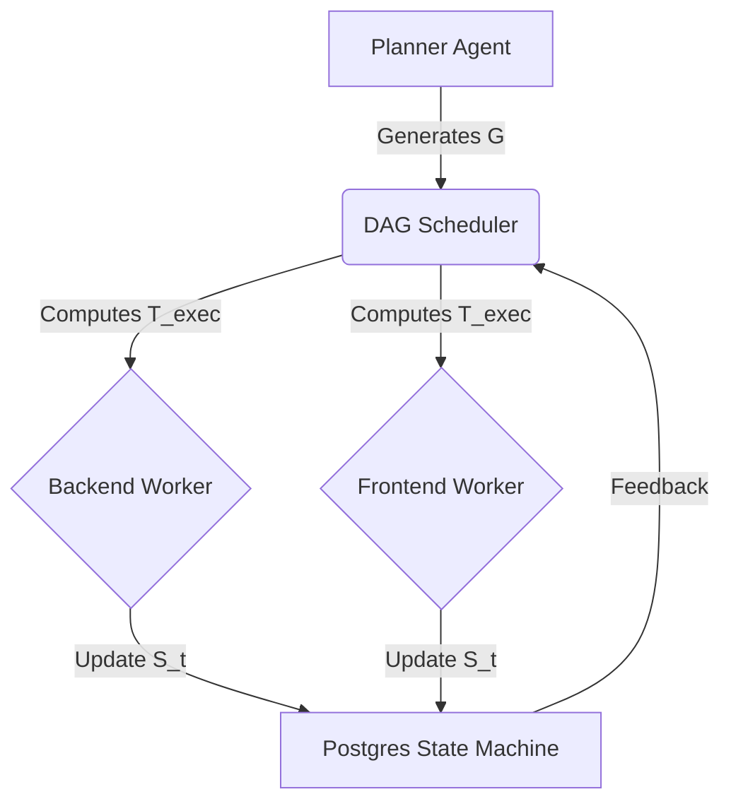

# Anti-Helper: Technical Deep Dive & Architectural Showcase

> **"From Hallucination to Determinism"**
> *Automating the transition from chaos to verified reality through Neuro-Symbolic State Machines.*

---

## 🚀 Executive Summary

**Anti-Helper** is a **Neurosymbolic Autonomous Agent System** designed to bridge the gap between "Generative Creativity" (LLMs) and "Deterministic Execution" (Compilers/Filesystems).

We address the fundamental **"Grounding Problem"** in AI Agents:
> *Given a generative model $M$ and a physical environment $E$, how do we ensure that actions $\alpha \in A$ predicted by $M$ result in valid state transitions in $E$?*

Most agents rely on probabilistic success tokens. Anti-Helper implements the **Deterministic Reality Protocol**, treating the Operating System as the only valid source of truth.

---

## 🧠 Core Architecture: A Formal Neurosymbolic Hybrid

We model the software engineering process not as a conversation, but as a pathfinding problem through a high-dimensional State Space.

### 1. State Space Formulation
We define the Global State $S_t$ at time $t$ as a tuple:
$$S_t = (G_t, \Sigma_t, \Delta_t, \Omega_t)$$

Where:
*   $G_t = (V, E)$: The **Dependency Graph** (DAG) of tasks.
*   $\Sigma_t$: The **Symbolic Blackboard** (Abstract Syntax Trees, Linter Rules, Contracts).
*   $\Delta_t$: The **Physical File System State** (The Truth on Disk).
*   $\Omega_t$: The **Context Window State** (Sliding Window Memory).

### 2. The Transition Function (Agent Execution)
An agent execution is defined as a transition function $\delta$:
$$\delta: S_t \times P \times K \to S_{t+1}$$

Where:
*   $P$: The Agent Persona (Prompt/Constraints).
*   $K$: The Knowledge Retrieval function (RAG).

The system enforces that $S_{t+1}$ is valid if and only if:
$$\text{Verify}(\Delta_{t+1}) \land \text{Lint}(\Sigma_{t+1}) = \text{True}$$

---

## 🏗️ The DAG Execution Engine (Topological Scheduling)

Linear execution (Chatbots) is $O(n)$ and fragile. We implement a **Topological Scheduler** that optimizes for parallelism.

### Formal Logic: The Scheduling Algorithm
Given the graph $G=(V, E)$, the scheduler seeks a set of executable tasks $T_{exec} \subset V$ such that:

$$T_{exec} = \{ v \in V \mid \text{status}(v) = \text{PENDING} \land \forall u, (u, v) \in E \implies \text{status}(u) = \text{COMPLETED} \}$$

*   **Deadlock Detection:** We detect cycles by verifying if the adjacency matrix $A$ satisfies $\text{Trace}(A^k) \neq 0$ for any $k \in [1, |V|]$.
*   **Concurrency:** If $|T_{exec}| > 1$, tasks are dispatched to parallel worker threads $W_1...W_n$.



---

## 🛡️ The "Deterministic Reality" Protocol

This protocol serves as the **Verification Function** $V(S)$ for the system.

### Subsystem 1: The Execution Enforcer ("The Sledgehammer")
We mitigate the "Ghost Code" problem where the LLM predicts a tool call but the side effect fails.
For any write operation $w(path, content)$, we verify:

$$V(w) = \exists \text{inode}(path) \land \text{size}(path) > 0$$

If $V(w)$ is False, the transition $\delta$ is rejected, and the system rolls back to $S_t$ with a feedback penalty.

### Subsystem 2: The Kill Switch (Asynchronous Interrupts)
We treat user control signals (Pause/Kill) as **External Interrupts** with highest priority.
The main loop checks the Signal Register $R_{sig}$ before every state transition:
$$\text{if } R_{sig} = \text{PAUSE} \implies \text{suspend}(\delta)$$

### Subsystem 3: The "Glass Cockpit" (Observability)
Instead of relying on LLM self-reporting ("I have done X"), we render the UI directly from $\Delta_t$ (File System) and $G_t$ (Task Graph).
*   **WebSocket Stream:** Pushes $\Delta S$ (State Deltas) in real-time.
*   **Truth-First Rendering:** The UI is a projection of the Database State, eliminating "frontend hallucination."

---

## 🔧 Advanced Tech Stack

*   **Orchestration:** `Dramatiq` (Actor Model for distributed processing).
*   **Database:** `PostgreSQL` + `pgvector` + `SQLAlchemy` (ACID compliance + vector search).
*   **State Machine:** Custom Event-Driven Architecture.
*   **Analysis:** `AST` (Abstract Syntax Tree) parsing for symbolic code validation.
*   **Embeddings:** OpenAI `text-embedding-3-small` (1536 dims).

---

## 🧠 Mnemosyne Memory System (Phase 4)

The agent system now includes long-term episodic memory via the **Mnemosyne Protocol**.

### Architecture

```
┌─────────────────────────────────────────────────┐
│           MemoryManager                         │
├─────────────────────────────────────────────────┤
│  save_experience(task, plan, outcome)           │
│    1. Summarize via gpt-4o-mini                 │
│    2. Embed via text-embedding-3-small          │
│    3. Store in memories table                   │
│    4. Create symbolic anchors (file paths)      │
├─────────────────────────────────────────────────┤
│  recall_context(task_desc, focus_files)         │
│    → Hybrid search (vector + anchors)           │
│    → Returns formatted context for prompts      │
└─────────────────────────────────────────────────┘
```

### Hybrid Search Query (Effective Rank)

The retrieval combines:
- **Vector similarity** (cosine distance via pgvector HNSW index)
- **Anchor matching** (+0.3 bonus per matching file path)
- **Confidence weighting** (success memories rank higher)

$$\text{score} = (1 - \text{cosine\_distance}) \times \text{confidence} + 0.3 \times |\text{anchor\_matches}|$$

---

## 🔮 Future / Roadmap

*   ~~**RAG (Retrieval Augmented Generation):**~~ ✅ Implemented via Mnemosyne.
*   **Sleep Cycle:** Dramatiq background task for memory consolidation/clustering.
*   **Active Learning:** Updating agent policies based on past failure rates.
*   **Neuro-Symbolic Compilation:** Compiling natural language plans directly into executable DAGs.

---

> *Anti-Helper: Where Formal Verification meets Generative AI.*
